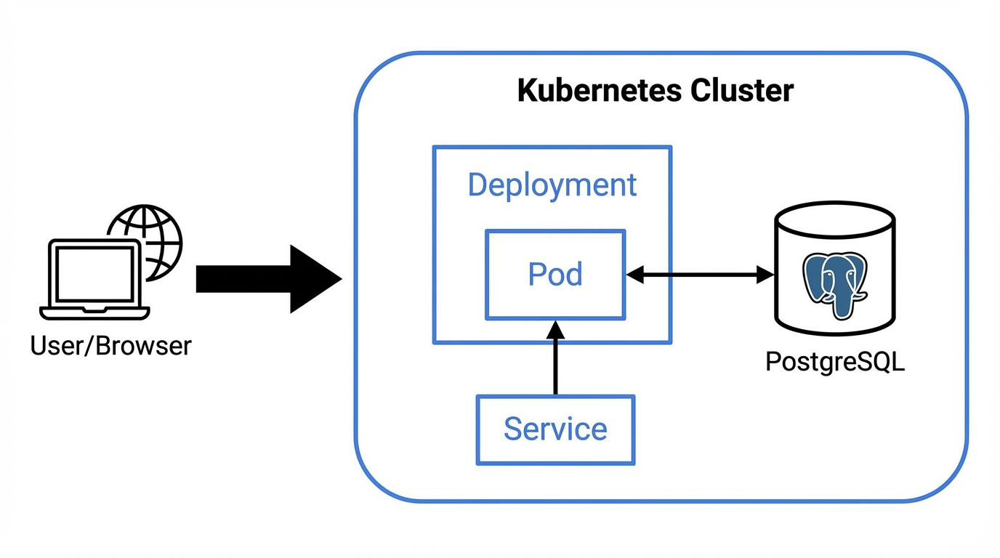

# Architecture, virtualisation et design de production

Lab RES507 — 85 Architecture, Virtualization, and Production Design.

---

## Diagramme d’architecture actuelle

Le schéma ci-dessous représente le déploiement actuel (utilisateur → cluster → Deployment/Pod → Service → PostgreSQL).



Réponses aux questions du lab :

- **Où se fait l’isolation ?** Au niveau des conteneurs (namespaces, cgroups) dans les pods, et entre pods via le réseau Kubernetes. La base PostgreSQL tourne dans le même pod que l’app ici ; en production on la sortirait pour isoler davantage.
- **Qu’est-ce qui redémarre automatiquement ?** Les pods gérés par le Deployment (via le ReplicaSet) : en cas de crash ou suppression, un nouveau pod est recréé pour maintenir le nombre de réplicas.
- **Qu’est-ce que Kubernetes ne gère pas ?** Le stockage persistant (PVC/PV dépendent d’un provisioner), les nœuds sous-jacents, le réseau hors cluster, les sauvegardes, le déploiement des images (build/push).

---

## 1. Conteneurs vs machines virtuelles

### Tableau comparatif (cinq différences)

| Critère | Conteneurs | Machines virtuelles |
|---------|------------|---------------------|
| Partage du noyau | Même noyau que l'hôte | Noyau dédié par VM (hyperviseur) |
| Démarrage | Secondes | Minutes |
| Surcoût ressources | Faible | Élevé (OS complet par VM) |
| Isolation sécurité | Processus (namespaces, cgroups) | Isolation matérielle |
| Complexité opérationnelle | Images légères, orchestration | Patching OS, gestion multi-OS |

### Quand préférer une VM au conteneur ?

- Isolation forte requise (conformité, multi-tenant hostile).
- OS ou noyau différent de l'hôte (ex. Windows).
- Workloads legacy non conteneurisables.

### Quand combiner les deux ?

- Nœuds Kubernetes = VMs (isolation, gestion parc).
- Base de données en VM ; applications en conteneurs dans le cluster.
- DMZ en VMs ; workloads internes en conteneurs.

---

## 2. Simulation de panne

### Qui a recréé le pod ?

Le **Deployment** (via le ReplicaSet). Il maintient le nombre de réplicas déclaré.

### Pourquoi ?

Boucle de réconciliation : le contrôleur détecte l'écart (pod manquant) et crée un nouveau pod pour atteindre le nombre cible.

### Si le nœud tombe en panne ?

Les pods du nœud sont marqués Terminating. Le control plane détecte le nœud down. Les Deployments recréent les pods sur les nœuds restants. Avec plusieurs nœuds et réplicas, le service reste disponible ; sinon, interruption jusqu'au rescheduling.

---

## 2b. Preuve d’une panne contrôlée (obligatoire)

Une panne a été volontairement introduite pour observer le comportement du cluster.

### Panne introduite

- **Modification** : image du conteneur `quote-app` changée en `quote-app:tag-inexistant` (tag qui n’existe pas).
- **Effet attendu** : le pod reste en `ImagePullBackOff` ou `ErrImagePull` ; le Deployment ne peut pas mettre le pod en Ready.

### Sortie typique `kubectl describe pod <pod-name>` (extrait)

```
Events:
  Type     Reason     Message
  ----     ------     ------
  Normal   Scheduled  Successfully assigned quote-lab/quote-app-xxx to node
  Warning  Failed     Failed to pull image "quote-app:tag-inexistant": rpc error: code = NotFound desc = failed to pull and unpack image ...
  Warning  Failed     Error: ErrImagePull
  Normal   BackOff    Back-off pulling image "quote-app:tag-inexistant"
  Warning  Failed     Error: ImagePullBackOff
```

### Sortie typique `kubectl get events` (extrait)

```
LAST SEEN   TYPE     REASON        OBJECT                    MESSAGE
...
2m          Warning   Failed        pod/quote-app-xxx         Failed to pull image "quote-app:tag-inexistant": ...
2m          Warning   Failed        pod/quote-app-xxx         Error: ErrImagePull
1m          Normal    BackOff       pod/quote-app-xxx          Back-off pulling image "quote-app:tag-inexistant"
1m          Warning   Failed        pod/quote-app-xxx          Error: ImagePullBackOff
```

### Analyse

- **Qui signale l’échec en premier ?** Le kubelet sur le nœud (pull d’image). Les events montrent `ErrImagePull` puis `ImagePullBackOff`.
- **Correction** : remettre l’image correcte dans le Deployment (ex. `quote-app:local`) et réappliquer le manifeste ; les nouveaux pods passent en Running et Ready.

Après correction, `kubectl get pods` montre des pods `Running` et `kubectl get events` ne contient plus d’erreurs pour ce déploiement.

---

## 3. Limites de ressources

### Requests vs limits

- **Requests** : ressources garanties pour le scheduling (le pod est placé sur un nœud qui peut les fournir).
- **Limits** : plafond ; au-delà : throttling CPU ou OOM Kill (mémoire).

### Importance en multi-tenant

Évite qu'un pod consomme toutes les ressources (noisy neighbour). Permet de réserver et de borner l'usage par équipe ou par namespace.

---

## 4. Readiness et liveness

### Différence

- **Liveness** : le conteneur est-il vivant ? Si échec → redémarrage du conteneur.
- **Readiness** : le pod est-il prêt pour du trafic ? Si échec → retrait des endpoints du Service (plus de requêtes envoyées au pod).

### Importance en production

Readiness évite d'envoyer du trafic à un pod en démarrage ou défaillant (moins de 502/503). Liveness permet de redémarrer automatiquement un processus bloqué.

---

## 5. Kubernetes et virtualisation

### Sous le cluster k3s

Des machines (physiques ou VMs) Linux. Chaque nœud = une machine avec kubelet/k3s.

### Kubernetes remplace-t-il la virtualisation ?

Non. Il s'appuie sur des nœuds souvent virtualisés. La virtualisation fournit l'infrastructure ; Kubernetes orchestre les conteneurs.

### Qui héberge les nœuds en cloud ?

Des instances de calcul (VMs) du provider : EC2, GCE, Azure VM, etc.

### Stack selon le contexte

- **Cloud** : nœuds = instances, stockage managé, Kubernetes managé ou self-hosted.
- **Automotive embarqué** : peu de nœuds, matériel dédié, contraintes temps réel.
- **Finance** : VMs en DC privé/hybride, réseau segmenté, conformité stricte.

---

## 6. Architecture de production

### Éléments à prévoir

- **Plusieurs nœuds** : HA et répartition de charge.
- **Persistance DB** : PVC/PV ou base managée hors cluster.
- **Sauvegardes** : snapshots, dumps DB, rétention, procédure de restauration.
- **Monitoring** : métriques (Prometheus), dashboards (Grafana), alertes.
- **Logging** : agrégation (EFK, Loki ou équivalent).
- **CI/CD** : build, tests, déploiement (Helm, Argo CD, GitOps).

### Où fait tourner quoi ?

- **Dans Kubernetes** : quote-app, Services, Ingress, Secrets/ConfigMaps.
- **En VM (ou managé)** : PostgreSQL de prod si besoin d'isolation/sauvegardes dédiées ; gros composants monitoring/logging.
- **Hors cluster** : load balancer, DNS, CI/CD, stockage sauvegardes, annuaire.

---

## 7. Secrets (extension obligatoire)

### Mieux que le texte en clair ?

Les manifests sont en Git : pas de mots de passe en clair. Les Secrets ont un cycle de vie et des droits RBAC dédiés. Possibilité de brancher un backend externe (Vault, cloud).

### Secret chiffré par défaut ? Où ?

Non. Par défaut les données sont en **base64** dans etcd (encodage, pas chiffrement). Le chiffrement au repos nécessite **Encryption at rest** pour etcd (config API server). En cloud managé (EKS, GKE, AKS), c'est souvent activable ou activé par défaut.
