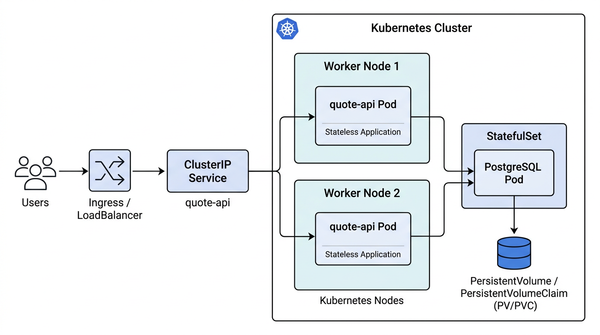

# Current System Problems

## 1. Application et base de données dans le même conteneur / Pod

**Quel est le problème ?**  
L’API `quote-api` et PostgreSQL tournent dans le **même conteneur, dans un seul Pod**, sans séparation claire entre application et base de données.

**Pourquoi est‑ce important ?**  
En production on veut des **responsabilités séparées** : l’application peut être répliquée et mise à jour fréquemment, alors que la base de données doit être gérée comme un composant stateful, avec son propre cycle de vie, sauvegardes, monitoring, et parfois une équipe différente. Mélanger les deux complique les mises à jour, le debug et l’observabilité.

**Quel risque / quelle panne ?**  
Un simple redéploiement de l’application redémarre aussi la base de données, provoquant **pertes de connexions**, risques de **corruption** si le stockage n’est pas géré proprement, et **indisponibilité complète** du système. Impossible aussi d’augmenter le nombre de réplicas d’application sans dupliquer la base de données dans chaque Pod.

---

## 2. Absence de persistance fiable pour PostgreSQL

**Quel est le problème ?**  
La base de données PostgreSQL est embarquée dans le Pod sans description explicite de **PersistentVolumeClaim** ni de stratégie de stockage ; elle dépend donc fortement du nœud et du cycle de vie du Pod.

**Pourquoi est‑ce important ?**  
Une base de données en production doit reposer sur un **stockage persistant** robuste (disque réseau, managed storage, etc.). Sans cela, tout redémarrage de Pod ou de nœud peut effacer les données.

**Quel risque / quelle panne ?**  
À chaque crash de Pod ou éviction de nœud, on risque la **perte totale des données** ou au minimum des incohérences. Cela rend le système inutilisable pour de vrais utilisateurs (aucune garantie que les citations sauvegardées existent encore après un incident).

---

## 3. Pas de probes (liveness / readiness)

**Quel est le problème ?**  
Le Pod ne définit pas de **readinessProbe** ni de **livenessProbe**.

**Pourquoi est‑ce important ?**  
En production, Kubernetes doit pouvoir **détecter** qu’un conteneur ne répond plus correctement (deadlock, fuite mémoire, base down, etc.) et doit aussi savoir **quand** l’application est prête à recevoir du trafic (DB connectée, migrations finies, etc.).

**Quel risque / quelle panne ?**  
Sans probes :
- Kubernetes continue d’envoyer du trafic à un Pod qui ne répond pas → **erreurs utilisateur**.
- Un conteneur « zombie » peut rester longtemps sans être redémarré → **MTTR** (Mean Time To Repair) plus élevé.
- Pendant les déploiements, un nouveau Pod peut recevoir du trafic avant d’être réellement prêt.

---

## 4. Aucune resource request / limit

**Quel est le problème ?**  
Aucun **requests** ni **limits** CPU/mémoire ne sont définis pour l’application ni pour la base de données.

**Pourquoi est‑ce important ?**  
Sans ces paramètres, Kubernetes ne peut pas **scheduler** correctement les Pods ni protéger le nœud d’une surconsommation. La base de données peut consommer toute la RAM, faire swapper le nœud ou provoquer un OOM kill.

**Quel risque / quelle panne ?**  
Un seul Pod peut :
- **Affamer** les autres workloads sur le nœud.
- Être tué brutalement pour cause d’OOM, avec risque de corruption de données.
- Rendre les performances très instables, donc difficilement observables.

---

## 5. Dépendance à un seul nœud et à un seul Pod

**Quel est le problème ?**  
Toute l’architecture repose sur **un seul Pod**, donc en pratique sur **un seul nœud** pour l’application et le stockage local.

**Pourquoi est‑ce important ?**  
En production, on recherche la **tolérance aux pannes** (au minimum à la panne d’un Pod, idéalement à la panne d’un nœud). Ici, la perte d’un seul Pod ou d’un seul nœud coupe le service complet.

**Quel risque / quelle panne ?**  
Toute panne du nœud (hardware, kernel panic, mise à jour système) entraîne :
- **Indisponibilité totale** de l’API.
- Risque de perte de données si les volumes étaient locaux.

---

## 6. Secrets en clair dans les variables d’environnement

**Quel est le problème ?**  
Les mots de passe PostgreSQL et autres secrets sont stockés en **texte clair** dans les manifestes (ou dans les env vars configurées directement).

**Pourquoi est‑ce important ?**  
Les secrets doivent être gérés via des mécanismes dédiés (`Secret` Kubernetes, gestion externe type Vault, etc.). Les avoir en clair dans le repo ou dans des fichiers de déploiement augmente fortement le **risque de fuite**.

**Quel risque / quelle panne ?**  
En cas de compromission du repo ou d’un accès non autorisé aux manifestes :
- Un attaquant récupère directement les **identifiants de base de données**.
- Il peut accéder aux données sensibles, les modifier ou les supprimer.

---

## 7. Stratégie de déploiement dangereuse (remplacement immédiat)

**Quel est le problème ?**  
Les déploiements remplacent les Pods « d’un coup » sans **rollout progressif** (ni `maxUnavailable`, ni canary / blue‑green).

**Pourquoi est‑ce important ?**  
Une mise à jour défectueuse ne doit pas impacter **tous** les utilisateurs d’un coup. On veut pouvoir tester la nouvelle version sur un sous‑ensemble des Pods, vérifier les probes et les métriques, et **revenir en arrière rapidement**.

**Quel risque / quelle panne ?**  
Une mauvaise version déployée coupe le service complet. Sans rollout progressif ni historique clair, le **rollback** est plus compliqué et le temps de panne augmente.

---

# Production Architecture

L’objectif est de concevoir une architecture réaliste pour la production, tout en restant simple et compréhensible.

## Composants principaux

- **Deployment application `quote-api`**
  - Plusieurs **réplicas** (par exemple 3) derrière un Service.
  - Variables d’environnement non sensibles en `ConfigMap`.
  - Secrets (password DB, URI) en `Secret`.
  - `readinessProbe` (par exemple `/healthz/ready`) et `livenessProbe` (`/healthz/live`).
  - `resources.requests` et `resources.limits` définis pour la mémoire et le CPU.

- **Service `quote-api`**
  - Type `ClusterIP` exposant les Pods de l’application.
  - Éventuellement un `Ingress` (ou un `LoadBalancer`) pour exposer le service aux utilisateurs externes.

- **Base de données PostgreSQL**
  - Déployée comme **StatefulSet** dédié.
  - Utilise un **PersistentVolumeClaim** (PVC) pour stocker les données.
  - Credentials stockés dans un **Secret**.
  - Idéalement un disque réseau fourni par le cloud (type managed disk) ou un backend de stockage fiable.

- **Stockage**
  - Un **PersistentVolume** dynamique (via StorageClass) ou statique adapté à PostgreSQL.
  - Données résilientes aux redémarrages de Pods et aux évictions de nœud.

## Séparation des responsabilités

- L’application `quote-api` est **stateless** : elle peut être répliquée, mise à jour et redémarrée sans perdre d’état métier.
- PostgreSQL est **stateful** : géré par un StatefulSet, avec stockage persistant, stratégie de mise à jour prudente et monitoring spécifique.

## Stratégie de déploiement

- Utilisation du **Deployment** avec stratégie `RollingUpdate` :
  - `maxUnavailable: 1` pour conserver la capacité pendant le déploiement.
  - `maxSurge: 1` pour permettre à un nouveau Pod d’apparaître avant que l’ancien disparaisse.
- En environnement plus avancé, possibilité de :
  - Mettre en place un **canary release** (par exemple, un deuxième Deployment et routage Ingress).
  - Ou un **blue‑green deployment** (deux versions complètes, bascule du trafic à travers un Ingress ou un load balancer).

## Diagramme d’architecture

Le diagramme suivant illustre cette architecture (utilisateurs → Ingress/LoadBalancer → Service `quote-api` → Pods `quote-api` sur plusieurs nœuds → StatefulSet PostgreSQL + stockage persistant) :

---

# Operational Strategy

## Comment le système scale‑t‑il ?

- L’application `quote-api` est répliquée via un **Deployment** avec plusieurs Pods derrière un Service.
- On peut ajuster manuellement le nombre de réplicas (ex. de 3 à 6) ou utiliser un **HorizontalPodAutoscaler (HPA)** basé sur la charge CPU/latence.
- Comme l’application est stateless, ajouter des réplicas permet de gérer plus de requêtes simultanées sans impacter la cohérence des données.
- PostgreSQL scale verticalement (plus de ressources) et, pour une version plus avancée, horizontalement via **réplicas en lecture** ou un service managé.

## Comment les mises à jour sont‑elles déployées en sécurité ?

- Utilisation de la stratégie **RollingUpdate** du Deployment :
  - Kubernetes crée un nouveau Pod avec la nouvelle image, attend qu’il soit **Ready** (grâce aux probes), puis retire un ancien Pod.
  - À tout instant, au moins `replicas - maxUnavailable` Pods restent disponibles.
- En cas de problème détecté (probes en échec, augmentation des erreurs HTTP, baisse des SLO), on peut :
  - **Stopper** le rollout (`kubectl rollout pause`).
  - **Rollback** vers la révision précédente (`kubectl rollout undo`).

## Comment les pannes sont‑elles détectées ?

- **LivenessProbe** :
  - Si l’application entre dans un état bloqué (deadlock, fuite mémoire sévère), la livenessProbe échoue et Kubernetes **redémarre** le conteneur.
- **ReadinessProbe** :
  - Tant que l’application n’est pas prête (dépendance DB non disponible, démarrage en cours), le Pod est marqué **NotReady** et le Service ne lui envoie pas de trafic.
- **Probes au niveau de PostgreSQL** (dans un setup plus avancé) :
  - Vérifier que PostgreSQL répond à une requête simple.
- **Monitoring externe** :
  - Métriques (latence, taux d’erreur), logs centralisés, alertes (Prometheus + Alertmanager, par exemple).

## Quels contrôleurs Kubernetes gèrent la récupération ?

- **Deployment** :
  - Assure qu’il y a toujours le bon nombre de Pods `quote-api`.
  - Gère les rollouts et rollbacks.
- **ReplicaSet** :
  - Contrôleur sous‑jacent au Deployment qui maintient le nombre de Pods desired.
- **StatefulSet** :
  - Gère les Pods PostgreSQL, leur identité stable, leur ordre de démarrage/arrêt et l’association avec les volumes persistants.
- **HorizontalPodAutoscaler (HPA)** (si configuré) :
  - Ajuste automatiquement le nombre de Pods `quote-api` en fonction de la charge.

---

# Weakest Point

## Quel est le point le plus faible de l’architecture et pourquoi ?

Dans cette architecture, le **point le plus faible** reste la **base de données PostgreSQL** :

- Même avec un StatefulSet et un stockage persistant, il n’y a qu’un **seul nœud PostgreSQL principal**.
- Une panne prolongée du stockage sous‑jacent ou une corruption de données peut rendre tout le système indisponible.
- Le scale horizontal de la base (sharding, réplicas multi‑régions, bascule automatique de primary) nécessite une complexité supplémentaire non couverte ici.

En pratique, sous forte charge ou face à des scénarios de panne sévères, la base de données sera donc **le premier goulot d’étranglement** ou **le premier composant critique** à adresser (mise en place d’une offre managée, réplication, sauvegardes et plans de restauration testés régulièrement).

